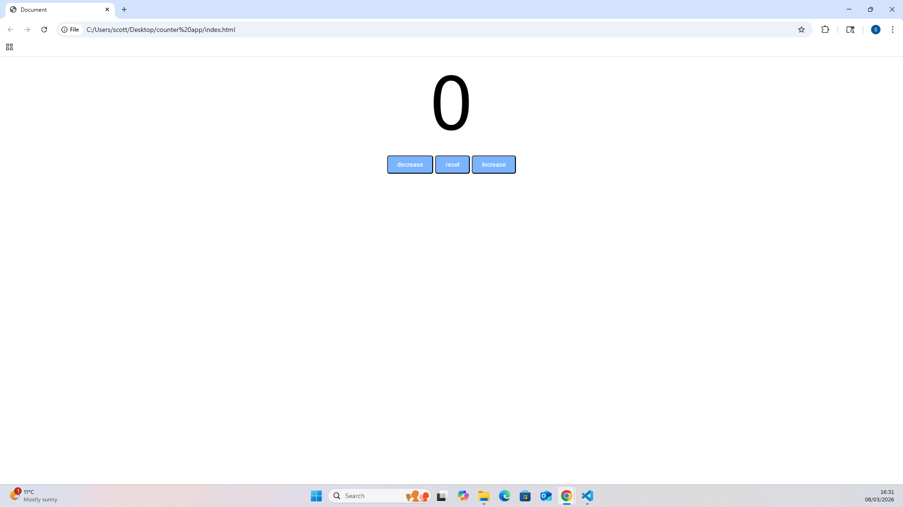

# Counter App

A simple counter application built with HTML, CSS and JavaScript.

## Features
- Increase the counter
- Decrease the counter
- Reset the counter

## Purpose
This project was built while learning JavaScript by following a YouTube tutorial.

## Technologies Used
- HTML
- CSS
- JavaScript

## Screenshot

## How to Run

1. Download or clone this repository
2. Open the project folder
3. Open `index.html` in your browser